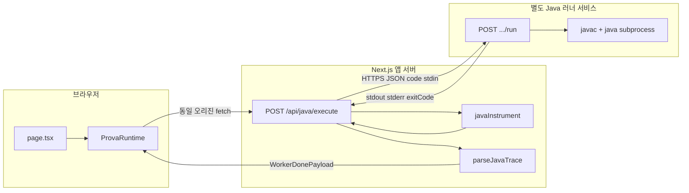

# PR: Java 실행 파이프라인 · 언어 공통화 · Enricher 분리

커밋 범위:
- `feat: Java 원격 실행 파이프라인 및 언어 공통화`
- `refactor(enrichment): 언어별 enricher 분리 + 초기화 패턴 기반 역할 단언 제거`

---

## 아키텍처: 브라우저 · Next · 별도 Java 러너

- **Python / JS**: 브라우저 Web Worker 내 실행
- **Java**: JVM 필요 → Prova 앱 외부 **전용 Java 실행 서버**에 위임
- **Next**: 해당 서버와 HTTP만 통신
- **`javac` / `java` 프로세스**: Java 러너 호스트에서만 실행



### 요청 흐름 단계

1. 브라우저 `ProvaRuntime` → 동일 오리진 **`POST /api/java/execute`**: 원본 코드, stdin, limits
2. Route Handler → **`JAVA_EXECUTION_SERVICE_URL` + `/run`**, `instrumentJavaCode` 적용 code
3. Java 서버 → 컴파일·실행 결과 **`{ stdout, stderr, exitCode }` JSON**
4. Next → stderr 트레이스 라인 `parseJavaTrace` → **`WorkerDonePayload`**, 이후 merge·시각화 파이프라인과 동일 형식

### 환경 변수 (`env.example` 동일 스키마)

| 변수 | 필수 | 내용 |
|------|------|------|
| `JAVA_EXECUTION_SERVICE_URL` | O | Java 러너 **베이스 URL** (끝 `/` 무관, 코드에서 `.../run` 접미) |
| `JAVA_EXECUTION_SERVICE_TOKEN` | X | 설정 시 **Next → Java 서버** 요청 헤더 `Authorization: Bearer` (러너 측 토큰 검증용) |

- **로컬 / 스테이징**: 러너 URL — 내부망 또는 `localhost`
- **프로덕션**: 방화벽·VPN·강 인증 전제
- **상세 계약**: [`docs/features/java-execution.md`](features/java-execution.md)

---

## Enricher 분리 (`refactor(enrichment)`)

### 변경 배경

기존 `enrichment.ts`는 `enrichSpecialVarKinds` 하나의 함수에 Python 전용 패턴이 집중되어 있었다.
Java enricher 추가 시 언어별 로직이 뒤섞이는 문제를 방지하기 위해 언어별 모듈로 분리했다.

### 파일 구조

```
app/api/analyze/_lib/
├── enrichment.ts           # 공통 함수만 잔류 (applyLanguageEnricher 디스패처, directionMap 가드, graphMode 추론, linearPivots)
└── enrichers/
    ├── python.ts           # applyPythonEnricher
    ├── javascript.ts       # applyJsEnricher
    └── java.ts             # applyJavaEnricher
```

### `applyLanguageEnricher` 디스패처

```ts
export function applyLanguageEnricher(meta, code, varTypes, language) {
  if (language === "python")     return applyPythonEnricher(meta, code, varTypes);
  if (language === "javascript") return applyJsEnricher(meta, code, varTypes);
  if (language === "java")       return applyJavaEnricher(meta, code, varTypes);
  return meta;
}
```

### 언어별 감지 규칙 요약

#### Python (`enrichers/python.ts`)

| 감지 조건 | 역할 |
|-----------|------|
| `heapq.heappush(v, ...)` / `heapq.heappop(v)` | HEAP |
| `deque()` 초기화 + `popleft()` 단독 | QUEUE |
| `deque()` 초기화 + `popleft()` + `appendleft()` | DEQUE |
| `.append()` + `.pop()` (heapq·popleft 없음) | STACK |
| `parent[x] = parent[parent[x]]` 경로 압축 패턴 | UNIONFIND |

#### JavaScript (`enrichers/javascript.ts`)

| 감지 조건 | 역할 |
|-----------|------|
| `push + pop` (shift/unshift 없음) | STACK |
| `push + shift` 또는 `unshift + pop` | QUEUE |
| `push + pop` AND `unshift + shift` | DEQUE |

> DFS/BFS 키워드 의존 제거 — 연산 패턴만으로 판단한다.

#### Java (`enrichers/java.ts`)

타입 선언으로 후보 변수를 식별한 뒤, 연산 패턴으로 역할을 확정한다.

| 타입 선언 | 연산 패턴 | 역할 |
|-----------|-----------|------|
| `ArrayDeque / Deque / LinkedList` | `addFirst` + `addLast` 양방향 | DEQUE |
| `ArrayDeque / Deque / LinkedList` | `push + pop` (LIFO) | STACK |
| `ArrayDeque / Deque / LinkedList` | `offer/add + poll/remove` (FIFO) | QUEUE |
| `PriorityQueue` | `offer/add` 또는 `poll/remove` | HEAP |
| `Stack` | `push` 또는 `pop` | STACK |

### 초기화 패턴 기반 역할 단언 완전 제거

기존 `enrichSpecialVarKinds`에 있던 아래 패턴들을 **모두 제거**했다.

```
// 제거된 패턴
[False]*n → VISITED
[INF]*n   → DISTANCE
boolean[] → VISITED
int[]     → DISTANCE
```

enricher의 책임 범위는 **"자료구조 연산 조합이 역할을 직접 규정하는 경우"** 로만 한정한다.
초기화·타입·변수명 기반 추론은 AI 판단 영역으로 위임한다. (`app/api/analyze/CLAUDE.md` 참조)

---

## 언어 공통화

### `SupportedLanguage` 타입 통일

```ts
// src/lib/language.ts
export type SupportedLanguage = "python" | "javascript" | "java";
```

- `lang(language).java` / `.js` / `.py` 유틸리티로 언어 분기 일원화
- `detectLanguageFromCode`의 `fallback` 파라미터에 삼항 연산자 대신 `language as SupportedLanguage` 직접 전달

### `ProvaRuntime` Java 분기

- Java 언어 선택 시 Worker 미사용 → `fetch("/api/java/execute")` 직접 호출
- `AbortController` + 타임아웃 처리
- `onError` / `onTimeout` Java 전용 분기 추가 (Worker 재초기화 불필요)

### `traceSanitize` / `collectUserDeclaredSymbols` Java 지원

- Java 선언 패턴(`int`, `boolean`, `String`, `List<>` 등) 인식 추가

### `/api/analyze` Java 분기

- `langSpecificHints`에 Java 전용 힌트 추가 (`switch` 분기)
- `normalizeResponse`의 `detectJavaPatterns` 폴백

---

## 포함 범위 전체

- **`POST /api/java/execute`**: `javaInstrument` 계측 → `JAVA_EXECUTION_SERVICE_URL`의 `/run` → `javaTraceParser` trace 병합
- **`ProvaRuntime`**: `lang().java` 시 Worker 미사용, `fetch("/api/java/execute")`, `AbortController`·타임아웃
- **언어 공통화**: `SupportedLanguage`, `lang()`, `languageDisplayLabel`, `detectLanguageFromCode`(java), `highlightJavaLine`, `traceSanitize`·`collectUserDeclaredSymbols`(java), `DebugCodeEditor`·`page` 연동
- **`/api/analyze`**: `switch` 기반 `langSpecificHints`(Java 분기), `normalize`의 `detectJavaPatterns` 폴백
- **Enricher 분리**: `enrichers/python.ts`, `enrichers/javascript.ts`, `enrichers/java.ts` 신설, `enrichSpecialVarKinds` 제거, 초기화 기반 역할 단언 제거
- **테스트 전면 재작성**: Java enricher 테스트 포함 (`_lib/__tests__/enrichment.test.ts`)
- **문서**: `docs/code-quality.md`, `docs/cross-language-parity.md`, `app/api/analyze/CLAUDE.md` 보강
- **`env.example`**, **`docs/features/java-execution.md`**, cursor rules 갱신

## 후속 PR 대상 (이번 범위 제외)

- `GridLinearPanel` 격자 UI 스케일·스크롤
- `public/worker/pyodide.worker.js` `post_exec` / stdout 정렬
- `src/types/prova.ts` `event: post_exec`
- `.cursor/rules/prova-ai-linear-visualization.mdc` 대규모 갱신
- `docs/code-quality.md`, `mocks/PR.md`, 확장 프롬프트 초안
